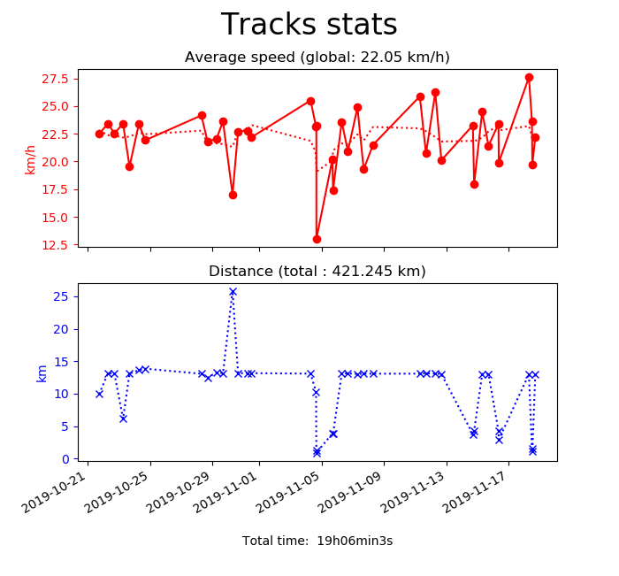

# BikeometerStats

## Description

This python script displays stats (total distance, total time, global average speed) and plots average speed and distance of each track.

The data is obtained from the exported tracks.bk file. As of 2019/11/29, Bikeometer has two bugs in data export:
- Time and avgSpeed are interverted in the track_details_table
- The last exported track only contains _id, date and start_timestamp

## Command line arguments

```
> python bikeometer.py --help
usage: bikeometer.py [-h] [-v] [-f FILE]

Plot statistics from Bikeometer exported file.

optional arguments:
  -h, --help            show this help message and exit
  -v, --verbose         Print table contents.
  -f FILE, --file FILE  Bikeometer exported file.
```

## Example results

```
> python bikeometer.py
Removing track 62 because average speed is 0.
Total distance: 538.369 km.
Total time: 24h01min48s.
Global average speed: 22.40 km/h.
Max speed: 41.78 km/h.
Total kcal: 5209.46 kcal.
Average power: 251.96 W.
```


