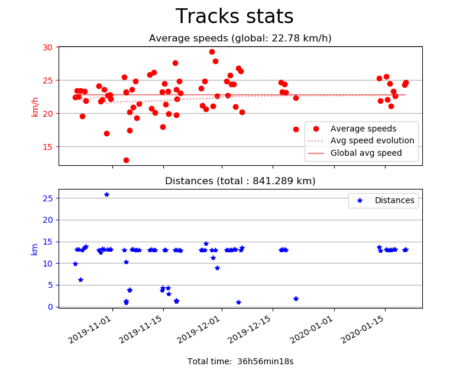

# BikeometerStats

## Description

This python script displays stats (total distance, total time, global average speed) and plots average speed and distance of each track.

The data is obtained from the exported tracks.bk file. As of 2019/10/30, Bikeometer has two bugs in data export:
- Time and avgSpeed are interverted in the track_details_table
- The last exported track only contains _id, date and start_timestamp

## Example results

```
> python bikeometer.py
Removing track 15 because average speed is 0.
Total distance: 134.924 km. Total time: 6h00min28s. Global average speed: 22.46 km/h.
```


